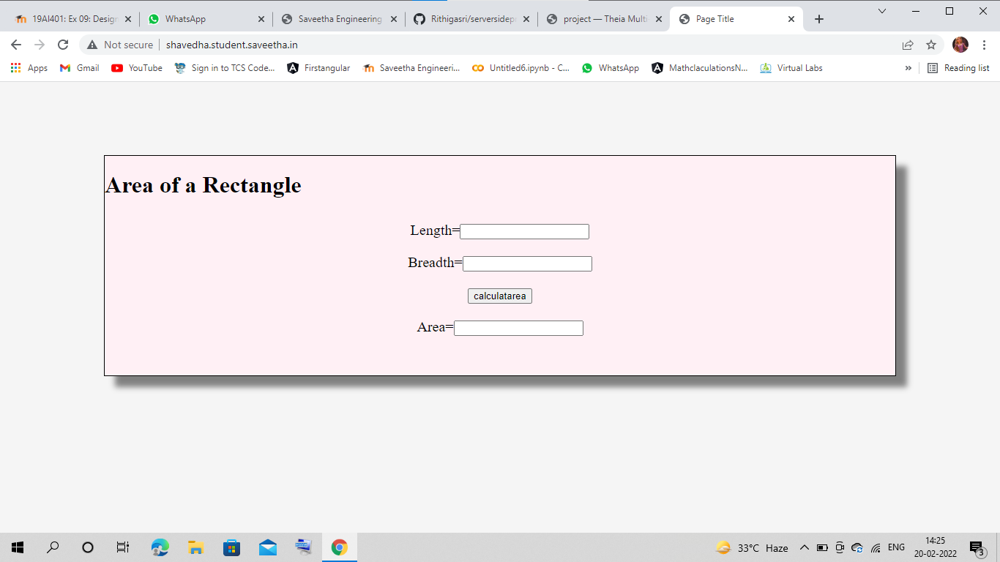
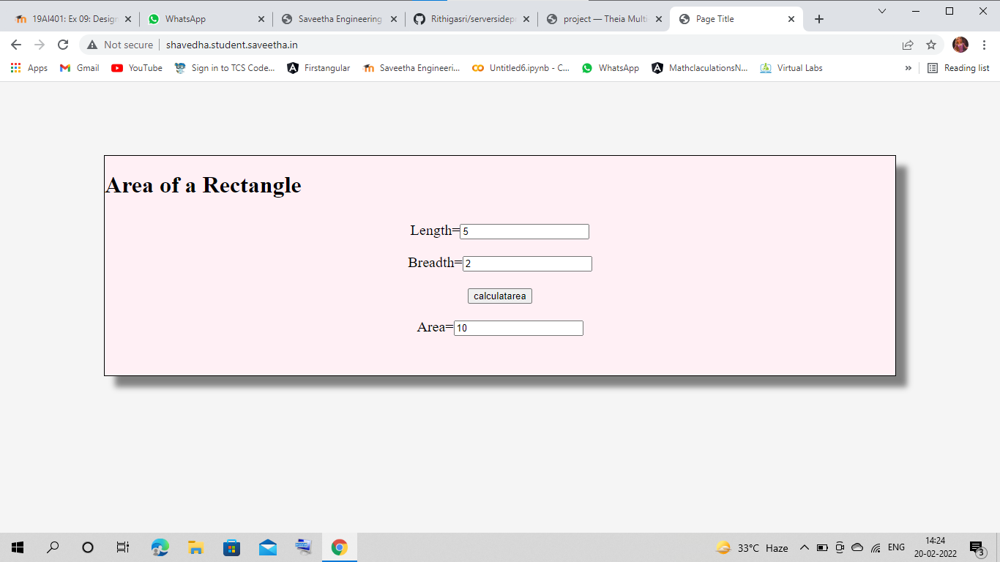

# Design a Website for Server Side Processing

## AIM:
To design a website to perform mathematical calculations in server side.

## DESIGN STEPS:

### Step 1:
Requirement collection.
### Step 2:
Creating the layout using HTML and CSS for performing calculation.
### Step 3:
Write views.py to get values and render it in server side.
### Step 4:
Add your created app in settings.py.
### Step 5:
Run the server.
### Step 6:
Publish the website in the given URL.
## PROGRAM :
HTML CODING
```
<!DOCTYPE html>
<html>
<head>
    <meta charset='utf-8'>
    <meta http-equiv='X-UA-Compatible' content='IE=edge'>
    <title>Page Title</title>
    <meta name='viewport' content='width=device-width, initial-scale=1'>
    <link rel='stylesheet' type='text/css' media='screen' href='main.css'>
    <script src='main.js'></script>
</head>
<style>
    .container{
    width: 1080px;
    height: 300px;
    margin-top: 100px;
    margin-left: auto;
    margin-right: auto;
    border-width: 1px 1px 1px 1px;
    border-style: solid;
    box-shadow: 15px 15px 8px gray;
    background-color:lavenderblush;
}
    .heading{
        text-align: center;
    }
    .content{
        padding-top: 10px;
        padding-bottom: 10px;
        padding-left: 10px;
        padding-right:10px;
        text-align: center;
        font-size: 20px;
    }
</style>
<body style="background-color:whitesmoke;">
<div class="container">
   <h1> Area of a Rectangle </h1>
   <form method="POST">
       
        <div class="content"> 
       Length=<input type="text" name="length" value={{l}}></input> </br> </div>
        <div class="content"> 
       Breadth=<input type="text" name="breadth" value={{b}}></input> </br> </div>
        <div class="content"> 
    <input type="submit" value="calculatarea"> </input> </br> </div>
     <div class="content"> 
       Area=<input type="text" name="area" value={{area}}> </input> </br> </div>
 </div>
   </form> 
</body>
</html>
```
views.py
```
from django.shortcuts import render

# Create your views here.

def areacalculation(request):
    context = {}
    context['area'] = "0"
    context['l'] = "0"
    context['b'] = "0"
    if request.method == 'POST' :
        l = request.POST.get('length','0')
        b = request.POST.get('breadth','0')
        area = int(l) * int(b)
        context['area'] = area
        context['l'] = l
        context['b'] = b
    return render(request,'mathapp/area.html',context)
```
urls.py
```
from django.contrib import admin
from django.urls import path
from mathapp import views
urlpatterns = [
    path('admin/', admin.site.urls),
    path('areaofrectangle/',views.areacalculation,name="areaofrectangle"),
    path('',views.areacalculation,name="areaofrectangleroot"),
]
```
## OUTPUT:




## Result:
Hence a website is designed to perform mathematical calculations in server side.
